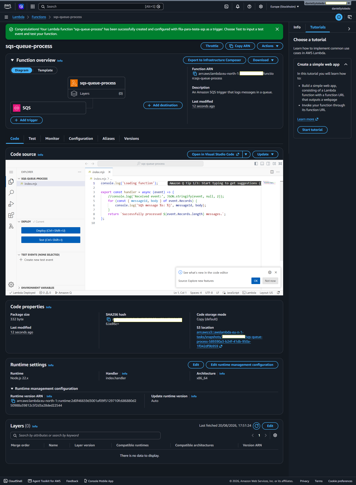
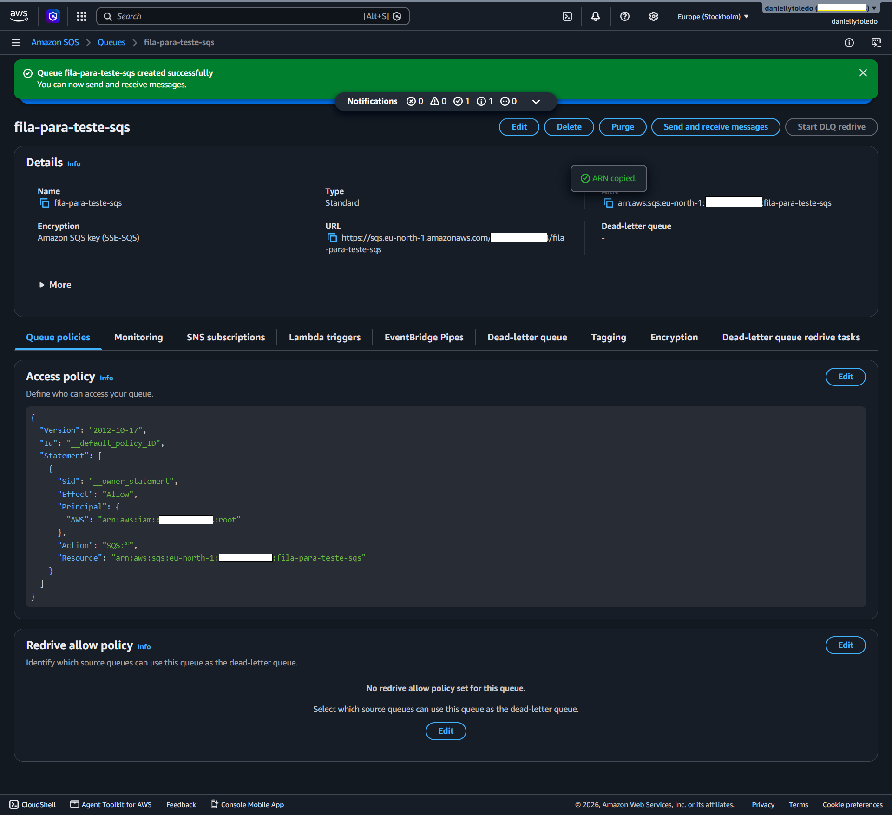
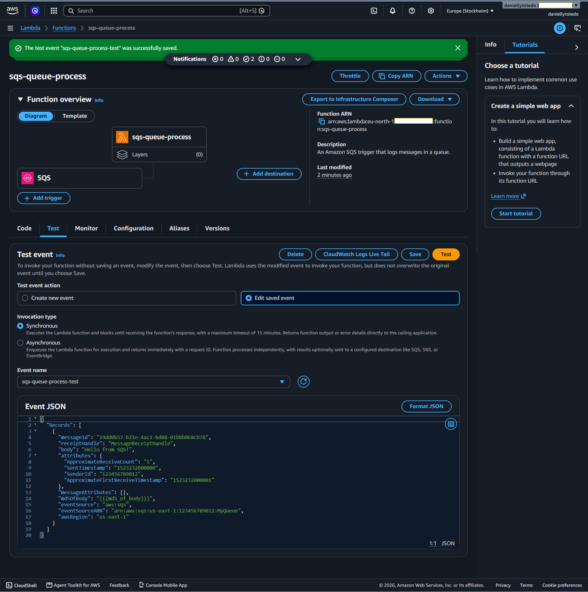
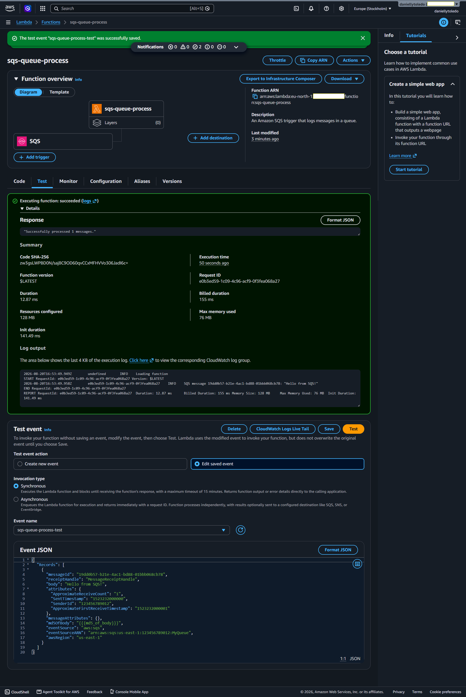

# Prática: Conta Root, AWS Lambda e Amazon SQS

> **Aula:** Computação em Nuvem sem Servidor
> **Tipo:** Prática avaliada
> **Nota:** os nomes dos ficheiros de imagem usados abaixo (`sqs-queue-process-function.png`, `fila-para-teste-sqs.png`, `sqs-queue-process-test.png`, `sqs-queue-process-test-results.png`) são uma sugestão baseada nos nomes dos recursos criados — ajusta os nomes exatos conforme os 4 prints guardados em `/Pratica_Integradora_Computacao_Nuvem/imagens/aws_sqs_queue_function/`.

---

## 1. Criar uma conta AWS (conta root)

Antes de qualquer prática na AWS, é preciso ter uma conta criada. A conta criada neste primeiro registo é sempre a **conta root**, que tem acesso total e irrestrito a todos os serviços e configurações de faturação (ver `01_aws.md` para mais detalhes sobre a diferença entre conta root e utilizadores IAM).

### Passo a passo

1. Aceder a [aws.amazon.com](https://aws.amazon.com) e clicar em **"Criar uma conta AWS"** (Create an AWS Account).
2. Inserir um **e-mail válido** e escolher um **nome para a conta AWS** (ex: nome pessoal ou da instituição de ensino).
3. Verificar o e-mail através do código enviado pela AWS.
4. Definir uma **password forte** para a conta root.
5. Preencher os **dados de contacto** (nome completo, morada, telefone).
6. Inserir um **cartão de crédito/débito válido** — a AWS exige um método de pagamento mesmo para usar apenas serviços dentro da camada gratuita (Free Tier), como forma de verificação de identidade. Não há cobrança automática se o uso ficar dentro dos limites gratuitos.
7. **Verificar o número de telefone** através de SMS ou chamada automática.
8. Escolher o **plano de suporte** (para fins de estudo, o plano gratuito "Basic Support" é suficiente).
9. Concluir o registo e aceder à **AWS Management Console**.

### Boas práticas logo após a criação da conta
- Ativar o **MFA (autenticação multifator)** na conta root imediatamente.
- Evitar usar a conta root no dia a dia — idealmente, criar um utilizador IAM com permissões administrativas para as tarefas práticas seguintes (ver `01_aws.md`, secção "Tipos de perfis / contas na AWS").

---

## 2. Aceder ao AWS Lambda e criar a função

Com a conta criada e a sessão iniciada na consola AWS, o próximo passo é navegar até ao serviço Lambda para criar a função que vai processar mensagens de uma fila SQS.

### Passo a passo

1. Na **AWS Management Console**, usar a barra de pesquisa no topo e escrever **"Lambda"**, selecionando o serviço nos resultados.
2. Clicar em **"Criar função"** (Create function).
3. Em vez de partir do zero, selecionar a opção de usar um **blueprint (modelo pré-configurado)** e escolher o blueprint **"Process messages in an SQS queue"** — um modelo pronto da AWS especificamente desenhado para consumir mensagens de uma fila SQS.
4. Dar um nome à função: **`sqs-queue-process`**.
5. Definir o **runtime** (linguagem de execução, ex: Node.js ou Python, conforme o blueprint escolhido).
6. Configurar a **role de execução (execution role)** — o Lambda precisa de uma role IAM com permissão para ler mensagens da fila SQS (ex: permissões `sqs:ReceiveMessage`, `sqs:DeleteMessage`, `sqs:GetQueueAttributes`).
7. Clicar em **"Criar função"** para concluir.



### O que esta função faz

O blueprint **"Process messages in an SQS queue"** cria uma função Lambda que é **acionada automaticamente sempre que chegam novas mensagens numa fila SQS associada** (ver `05_computacao_sem_servidor.md`, secção 1, sobre sistemas de mensagens e enfileiramento).

Na prática, o código gerado por este blueprint:

1. Recebe como parâmetro de entrada (*event*) um lote de mensagens da fila SQS.
2. Percorre cada mensagem recebida (o SQS pode entregar várias mensagens numa só invocação, em lote).
3. Processa o conteúdo de cada mensagem — no exemplo base, normalmente apenas regista o conteúdo nos logs (via `console.log` ou `print`, dependendo do runtime), mas esta lógica pode ser personalizada para fazer qualquer processamento necessário (ex: guardar os dados numa base de dados, enviar uma notificação, chamar outra API).
4. Após o processamento bem-sucedido, a mensagem é automaticamente removida da fila (ou, dependendo da configuração, é a própria integração Lambda-SQS que trata da eliminação após a execução terminar sem erros).

Este padrão é a base de arquiteturas **orientadas a eventos**: em vez de um servidor estar constantemente à escuta da fila (o que exigiria uma máquina sempre ligada), o Lambda só "acorda" e executa quando há efetivamente mensagens novas para processar — sendo cobrado apenas por esse tempo de execução (ver `05_computacao_sem_servidor.md`, secção 2, sobre computação sem servidor).

---

## 3. Criar a fila Amazon SQS

Para que a função Lambda tenha algo para processar, é necessário criar a fila SQS e associá-la à função como *trigger* (gatilho).

### Passo a passo

1. Na barra de pesquisa da consola AWS, escrever **"SQS"** e aceder ao serviço **Amazon Simple Queue Service**.
2. Clicar em **"Criar fila"** (Create queue).
3. Escolher o **tipo de fila**: Standard (throughput mais alto, sem garantia estrita de ordem) ou FIFO (ordem garantida) — para fins de teste, a fila Standard é suficiente (ver `05_computacao_sem_servidor.md` para a diferença entre os dois tipos).
4. Dar o nome **`fila-para-teste-sqs`** à fila.
5. Manter as configurações padrão (tempo de visibilidade, retenção de mensagens, etc.), ajustáveis conforme a necessidade.
6. Clicar em **"Criar fila"** para concluir.
7. Voltar à função Lambda `sqs-queue-process` e, na secção **"Triggers"** (gatilhos), adicionar a fila `fila-para-teste-sqs` como origem de eventos — isto liga a fila à função, para que qualquer mensagem depositada nela acione automaticamente a execução do Lambda.



---

## 4. Criar o teste da função (test event)

Antes de depender de mensagens reais na fila, o Lambda permite simular um evento de teste diretamente na consola, o que é essencial para validar se a função está a processar corretamente o formato de dados esperado de uma mensagem SQS.

### Passo a passo

1. Dentro da função `sqs-queue-process`, aceder ao separador **"Test"** (Testar).
2. Clicar em **"Create new test event"** (Criar novo evento de teste).
3. Escolher um **modelo de evento (event template)** — a AWS disponibiliza um template pronto chamado **"SQS"**, que já simula a estrutura de dados que a função recebe quando é acionada por uma mensagem real da fila (incluindo campos como `body`, `messageId`, `eventSourceARN`, etc.).
4. Dar o nome **`sqs-queue-process-test`** ao evento de teste.
5. Ajustar, se necessário, o conteúdo do campo `body` dentro do JSON de teste, para simular uma mensagem específica.
6. Guardar o evento de teste clicando em **"Save"** (Guardar).



---

## 5. Executar o teste e analisar o resultado

Com o evento de teste criado, o passo final é executá-lo e verificar se a função processa corretamente os dados simulados.

### Passo a passo

1. Com o evento de teste `sqs-queue-process-test` selecionado, clicar no botão **"Test"** (Testar), no topo da página da função.
2. Aguardar a execução da função — a AWS mostra o **resultado da execução (execution result)**, incluindo:
   - O valor devolvido pela função (*response*)
   - Os **logs de execução**, gerados através dos `console.log`/`print` presentes no código
   - O **relatório de resumo** (summary), com duração da execução, memória usada e status (sucesso ou erro)
3. Analisar os logs para confirmar que a mensagem simulada foi corretamente lida e processada pela função.



### O que validar no resultado
- **Status "Succeeded"** — confirma que a função correu sem erros.
- **Conteúdo dos logs** — deve mostrar o conteúdo da mensagem simulada a ser processado (ex: o texto do campo `body` do evento de teste).
- **Duração da execução** — útil para perceber o desempenho da função e, futuramente, ajustar o timeout configurado, se necessário.

---

## Resumo do fluxo completo da prática

```
Conta root AWS criada
        │
        ▼
Função Lambda "sqs-queue-process" criada (blueprint: Process messages in an SQS queue)
        │
        ▼
Fila SQS "fila-para-teste-sqs" criada e associada como trigger da função
        │
        ▼
Evento de teste "sqs-queue-process-test" criado (simula uma mensagem SQS)
        │
        ▼
Teste executado → resultado "sqs-queue-process-test-results" analisado nos logs
```

---

## O que isso significa na vida real? 😖

Prática: criar uma função no AWS Lambda, ou seja, um código que roda na nuvem sem eu precisar gerenciar nenhum servidor e conectá-la a uma fila no Amazon SQS, um serviço que guarda mensagens até que alguém (no caso, minha função) esteja pronto para processá-las.

**O fluxo foi assim:**
 - 📥 Uma mensagem chega na fila do SQS.
 - ⚙️ O Lambda "acorda" automaticamente e processa essa mensagem.
 - ✅ Tudo isso sem eu precisar ligar, configurar ou manter servidor nenhum.

**Parece simples dito assim, mas por trás disso está um dos conceitos mais bacanas da nuvem: pagar e usar recursos só quando realmente precisa deles, sem desperdício.**

## Imagina um sistema de e-commerce...

Quando alguém finaliza uma compra, várias coisas precisam acontecer: confirmar o pagamento, atualizar o estoque, enviar um e-mail de confirmação, notificar o setor de logística, etc. Se o sistema tentasse fazer tudo isso na hora, um atrás do outro, diretamente, teria alguns problemas:

- ⚠️ Se o serviço de e-mail estiver lento ou fora do ar, o cliente fica esperando a compra "travar" na tela.
- ⚠️ Se um desses serviços cair, a informação simplesmente se perde.
- ⚠️ Tudo fica dependente de tudo — se uma peça falha, o sistema inteiro trava.

**É aí que entra a fila (SQS):** em vez de disparar tudo na hora, o sistema só coloca uma mensagem na fila dizendo "ei, tem uma compra nova pra processar" e segue a vida dele, sem esperar ninguém responder. A mensagem fica guardada na fila com segurança, esperando para ser processada.

**E a função Lambda?** É quem vai lá, pega essa mensagem quando ela chega, e faz o processamento necessário. No meu caso, na prática, é um exemplo simples de leitura e processamento da mensagem, mas na vida real seria algo como `"processar o pedido"`, `"atualizar um cadastro"`, `"gerar uma notificação"`, etc.

**Por que isso é útil?** Os sistemas ficam desacoplados: 

- ☁️ Um não precisa esperar o outro responder na hora.
- ☁️ Se a função Lambda estiver ocupada ou cair por um segundo, a mensagem não se perde, ela fica na fila esperando. 
- ☁️ Você só paga pelo Lambda no exato momento em que ele está processando algo, sem servidor ligado 24h esperando mensagens chegarem.

Ou seja: na prática que eu fiz, o objetivo não era o conteúdo da mensagem em si (que era só um teste), mas sim entender esse padrão de **arquitetura**: `fila` + `função sem servidor`, que é usado o tempo todo em sistemas reais para tornar tudo mais resiliente e barato.

---

## Conceitos relacionados para estudar a seguir

- **SQS Standard vs. FIFO** — aprofundar as diferenças de garantias de ordem e entrega (ver `05_computacao_sem_servidor.md`)
- **IAM Roles para Lambda** — como funcionam as permissões de execução que permitem ao Lambda aceder ao SQS (ver `01_aws.md`)
- **Dead Letter Queues (DLQ)** — fila secundária para onde vão mensagens que falham repetidamente no processamento, útil para tratamento de erros
- **CloudWatch Logs** — onde ficam guardados, de forma permanente, os logs gerados pela execução da função Lambda
