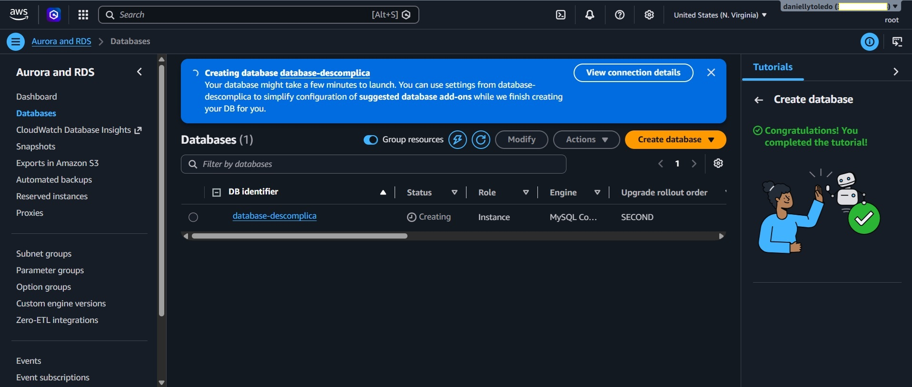
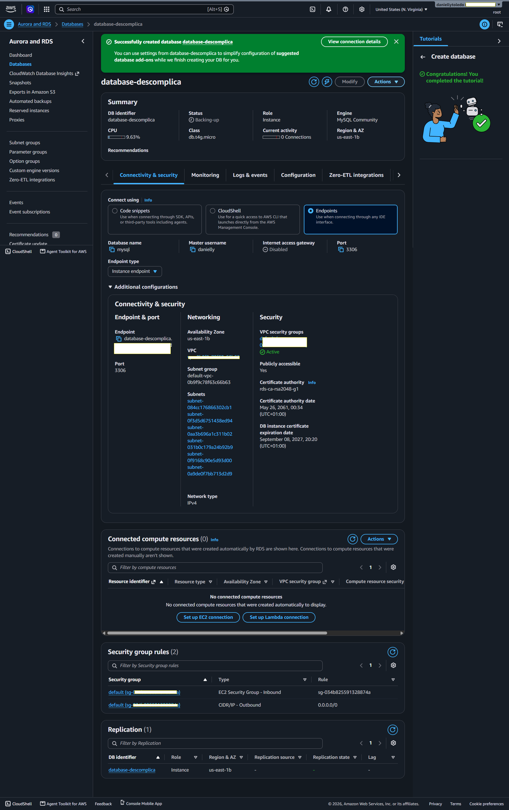

# Ferramentas e Características de Bancos de Dados em Nuvem

---

## 1. Introdução aos serviços de banco de dados em nuvem

### O que mudou com a nuvem
Antes da computação em nuvem (ver `00_computacao_em_nuvem.md`), gerir um banco de dados em ambiente corporativo envolvia uma série de responsabilidades que nada tinham a ver com o desenvolvimento de software em si:

- Comprar e instalar o servidor físico
- Instalar e licenciar o software de banco de dados (ex: MySQL, Oracle, SQL Server)
- Configurar backups manuais e políticas de retenção
- Gerir atualizações de versão e patches de segurança
- Monitorizar performance e disponibilidade continuamente
- Planejar capacidade com antecedência (e frequentemente errar, comprando a mais ou ficando sem espaço)

A nuvem transfere a maior parte (ou a totalidade) dessas responsabilidades para o fornecedor, permitindo que as equipas de desenvolvimento foquem no que realmente gera valor: **o dado em si e as aplicações que o consomem**.

### Modelos de banco de dados disponíveis na nuvem

| Modelo | Descrição | Serviço AWS principal |
|---|---|---|
| **Relacional (SQL)** | Dados organizados em tabelas com relações, consultáveis via SQL | Amazon RDS, Amazon Aurora |
| **NoSQL — Chave-valor** | Armazenamento de pares chave-valor com acesso ultrarrápido | Amazon DynamoDB |
| **NoSQL — Documento** | Documentos JSON/BSON semi-estruturados | Amazon DocumentDB |
| **Data Warehouse** | Otimizado para análise de grandes volumes de dados históricos (OLAP) | Amazon Redshift |
| **Cache em memória** | Armazenamento em RAM para acesso em microssegundos | Amazon ElastiCache |
| **Grafo** | Dados organizados como nós e relações | Amazon Neptune |
| **Série temporal** | Dados com forte componente temporal (ex: métricas, telemetria) | Amazon Timestream |

### Vantagens gerais dos bancos de dados geridos na nuvem
- **Managed service** — a AWS gere o hardware, o sistema operativo e o motor do banco de dados; o utilizador apenas gere os dados e as aplicações.
- **Alta disponibilidade por padrão** — réplicas automáticas, failover automático, backups automáticos.
- **Escalabilidade** — aumentar ou diminuir a capacidade em poucos cliques ou automaticamente.
- **Segurança integrada** — encriptação em repouso e em trânsito, integração com IAM (ver `01_aws.md`), isolamento via VPC (ver `08_conectividade_aws.md`).
- **Custo previsível** — pagamento por uso, sem investimento inicial em hardware.

---

## 2. Amazon RDS — banco de dados relacional gerido na nuvem

### O que é o Amazon RDS
O **Amazon RDS (Relational Database Service)** é o serviço da AWS para criar, operar e escalar **bancos de dados relacionais** na nuvem, de forma totalmente gerida. Suporta os principais motores de banco de dados do mercado, sem que o utilizador precise de instalar ou manter o software subjacente.

### Motores suportados

| Motor | Observação |
|---|---|
| **MySQL** | Um dos mais populares no mundo open-source |
| **PostgreSQL** | Open-source, muito usado em aplicações modernas |
| **MariaDB** | Fork comunitário do MySQL |
| **Microsoft SQL Server** | Solução proprietária da Microsoft |
| **Oracle Database** | Solução proprietária da Oracle |
| **Amazon Aurora** | Motor proprietário da AWS, compatível com MySQL e PostgreSQL, com performance até 5x superior ao MySQL e 3x ao PostgreSQL standard |

### O que o RDS gere automaticamente
- **Provisionamento de hardware** — sem servidores físicos a instalar
- **Instalação e configuração do motor** — a versão do MySQL, PostgreSQL, etc. é selecionada e configurada pela AWS
- **Backups automáticos** — com retenção configurável (até 35 dias), com possibilidade de restaurar para qualquer ponto no tempo dentro desse período (*point-in-time recovery*)
- **Patches de software** — aplicados de forma gerida, com janelas de manutenção definidas pelo utilizador
- **Monitorização** — métricas de CPU, memória, conexões e I/O disponíveis no CloudWatch
- **Failover automático** — em configurações Multi-AZ, se a instância principal falhar, o tráfego é automaticamente redirecionado para a réplica em standby

### Multi-AZ — alta disponibilidade no RDS
Em modo **Multi-AZ**, o RDS mantém uma **réplica síncrona** da instância principal numa AZ diferente (ver `07_infraestrutura_global_aws.md`, ponto 3):

```
AZ-a                              AZ-b
┌────────────────┐                ┌────────────────┐
│ Instância RDS  │  replicação    │ Instância RDS  │
│   principal    │ ─────────────▶ │   standby      │
│  (leitura e   │   síncrona     │  (apenas em    │
│   escrita)    │                │   standby)     │
└────────────────┘                └────────────────┘
        │
        ▼ (em caso de falha da AZ-a)
  Failover automático (~1-2 minutos)
  → AZ-b assume como principal
```

### Read Replicas — escalabilidade de leitura
Para cargas de trabalho com muitas operações de leitura, o RDS permite criar **Read Replicas** — réplicas assíncronas usadas exclusivamente para operações de leitura, aliviando a carga da instância principal.

---

## 3. Gerenciamento de serviços de banco de dados relacionais na nuvem

### O modelo de responsabilidade partilhada aplicado ao banco de dados

```
Responsabilidade da AWS (gerida):        Responsabilidade do utilizador:
━━━━━━━━━━━━━━━━━━━━━━━━━━━━━━━━━        ━━━━━━━━━━━━━━━━━━━━━━━━━━━━━━━
Hardware físico                          Schema e modelação dos dados
Sistema operativo do servidor            Queries e otimização de índices
Motor do banco de dados (patches)        Gestão de utilizadores do DB
Backups automáticos                      Dados e a sua segurança lógica
Failover e alta disponibilidade          Configuração de parâmetros do DB
Rede e infraestrutura física             Definição de permissões de acesso
```

### Principais ferramentas de gestão disponíveis

**Parameter Groups**
Permitem configurar parâmetros do motor (ex: tamanho máximo de conexões, timeout de queries, charset) de forma centralizada e reutilizável entre várias instâncias RDS.

**Option Groups**
Permitem adicionar funcionalidades opcionais ao motor do banco de dados (ex: plugins específicos do Oracle ou SQL Server).

**Subnet Groups**
Definem em que sub-redes da VPC (ver `08_conectividade_aws.md`) a instância RDS pode ser colocada — fundamental para que o banco de dados fique numa sub-rede privada (recomendado) em vez de pública.

**Security Groups**
Controlam que endereços IP ou outros recursos AWS podem fazer conexões ao banco de dados (ver `08_conectividade_aws.md`, ponto 1).

**AWS Database Migration Service (DMS)**
Serviço gerido para migrar bancos de dados de fontes on-premises ou de outros motores para o RDS, com suporte a migrações **homogéneas** (ex: MySQL → MySQL no RDS) e **heterogéneas** (ex: Oracle on-premises → PostgreSQL no RDS).

---

## 4. Amazon DynamoDB — banco de dados NoSQL na nuvem

### O que é o DynamoDB
O **Amazon DynamoDB** é o serviço de banco de dados **NoSQL** totalmente gerido da AWS, do tipo **chave-valor e documento**. Desenhado para ser extremamente rápido e escalável, independentemente do volume de dados ou do número de pedidos por segundo.

### Conceitos centrais do DynamoDB

| Conceito | Equivalente relacional | No DynamoDB |
|---|---|---|
| Tabela | Tabela | Tabela |
| Linha | Registo | Item |
| Coluna | Campo | Atributo |
| Chave primária | Primary Key | Partition Key + Sort Key (opcional) |

- **Partition Key**: atributo principal pelo qual o DynamoDB distribui e localiza os itens internamente. Deve ter alta cardinalidade para distribuição eficiente.
- **Sort Key**: quando combinada com a Partition Key, permite guardar múltiplos itens com a mesma Partition Key, ordenados pela Sort Key.

### Características que distinguem o DynamoDB
- **Performance consistente a qualquer escala**: latências de **milissegundos a um dígito**, com 1.000 ou 1.000.000.000 de itens.
- **Totalmente serverless**: escala automaticamente a capacidade de leitura e escrita conforme a procura (modo On-Demand), ou permite reservar capacidade para cargas previsíveis (modo Provisioned).
- **DynamoDB Streams**: regista todas as alterações aos itens em tempo real, acionando funções Lambda (ver `05_computacao_sem_servidor.md`) automaticamente.
- **Global Tables**: replicação automática multi-região para acesso de baixa latência de utilizadores em diferentes continentes.
- **TTL (Time to Live)**: define uma data de expiração para itens individuais, eliminados automaticamente quando essa data é atingida.

### Quando usar DynamoDB em vez de RDS

| Usar **DynamoDB** quando... | Usar **RDS** quando... |
|---|---|
| A escala é imprevisível ou muito grande | Os dados têm relações complexas entre tabelas |
| Performance de leitura/escrita é crítica (sub-ms) | As queries são complexas (JOINs, agregações) |
| O esquema de dados é flexível | A consistência transacional (ACID) é obrigatória |
| A aplicação é event-driven ou serverless | A equipa já domina SQL |

---

## 5. Amazon Redshift — data warehouse na nuvem

### O que é o Amazon Redshift
O **Amazon Redshift** é o serviço de **data warehouse** gerido da AWS — um banco de dados otimizado não para transações do dia a dia (OLTP), mas para **análise de grandes volumes de dados históricos** (OLAP).

### A diferença entre OLTP e OLAP

| | OLTP (ex: RDS) | OLAP (ex: Redshift) |
|---|---|---|
| **Operações típicas** | INSERT, UPDATE, DELETE frequentes | SELECT com agregações sobre grandes volumes |
| **Volume de dados por query** | Pequeno (poucos registos) | Grande (milhões a biliões de registos) |
| **Optimização** | Para velocidade de escrita e transações | Para velocidade de leitura e análise |
| **Utilizadores típicos** | Aplicações em produção | Analistas de dados, BI |
| **Exemplo de pergunta** | "Qual o saldo atual do utilizador X?" | "Qual foi a receita por região nos últimos 3 anos?" |

### Como o Redshift funciona
Usa **armazenamento colunar** — em vez de guardar dados linha a linha, guarda-os coluna a coluna. Queries analíticas que apenas precisam de algumas colunas de tabelas com biliões de linhas são muito mais eficientes, pois só leem as colunas relevantes do disco.

### Integração com o ecossistema AWS de dados
- **S3**: o Redshift integra-se nativamente com o S3, carregando dados diretamente de buckets (`COPY`) ou exportando resultados para o S3 (`UNLOAD`).
- **Redshift Spectrum**: executa queries SQL diretamente sobre dados no S3, sem precisar de os importar para o Redshift.
- **Amazon QuickSight**: ferramenta de BI da AWS que consome dados do Redshift para criar dashboards e relatórios.

---

## 6. Amazon ElastiCache — cache em tempo real para cargas de trabalho variadas

### O que é cache e por que importa
Uma **cache** é uma camada de armazenamento de alta velocidade (em memória RAM), que guarda temporariamente resultados de operações frequentes e custosas para que pedidos seguintes idênticos possam ser respondidos muito mais rapidamente, sem repetir o processamento original.

```
Sem cache:
Aplicação → Banco de dados → calcula resultado → responde (~50ms)

Com cache:
Aplicação → Cache (hit) → responde imediatamente (~0.1ms)
```

### O que é o Amazon ElastiCache
O **Amazon ElastiCache** é o serviço gerido de cache em memória da AWS, suportando dois motores open-source:

| Motor | Características | Melhor para |
|---|---|---|
| **Redis** | Estruturas de dados complexas, persistência opcional, replicação, pub/sub | Cache avançada, sessões, filas, leaderboards, contadores |
| **Memcached** | Mais simples, sem persistência, escalabilidade horizontal simples | Cache pura, quando não são necessárias funcionalidades avançadas |

### Casos de uso típicos do ElastiCache
- **Cache de queries**: resultados de queries SQL pesadas guardados em cache — as queries seguintes não chegam ao banco de dados.
- **Gestão de sessões de utilizador**: sessões guardadas centralmente, para que qualquer servidor possa autenticar qualquer utilizador.
- **Leaderboards em tempo real**: o Redis suporta sorted sets perfeitos para rankings (ex: jogos online).
- **Pub/Sub**: comunicação em tempo real entre componentes de uma aplicação (ver `05_computacao_sem_servidor.md`, sobre SNS).
- **Rate limiting**: controlar o número de pedidos de um utilizador num período definido.

---

## 7. Prática — criação de banco de dados MySQL no Amazon RDS

### O que foi feito
Nesta aula prática foi criado um banco de dados **MySQL** através do **Amazon RDS** na AWS Management Console, com o nome **`database-descomplica`**, configurado como publicamente acessível para permitir ligação a partir de ferramentas externas.



### Passo a passo da criação

1. Aceder à **AWS Management Console** e navegar até ao serviço **RDS**.
2. Clicar em **"Create database"**.
3. Escolher o método **"Standard create"**.
4. Selecionar o motor: **MySQL**.
5. Escolher o template: **"Free Tier"** (gratuito dentro dos limites da AWS Free Tier, adequado para estudo).
6. Definir as configurações principais:
   - **DB instance identifier**: `database-descomplica`
   - **Master username**: `admin`
   - **Master password**: password segura definida pelo utilizador
7. Tipo de instância: `db.t3.micro` (elegível para Free Tier).
8. Armazenamento: SSD de uso geral (gp2), 20 GB.
9. Em **"Connectivity"**:
   - VPC: a VPC padrão
   - **"Publicly accessible": Yes** — permite ligações externas ao endpoint
   > Em produção, esta opção deve ser desativada — o acesso deve ser feito apenas via VPC privada ou Direct Connect (ver `08_conectividade_aws.md`).
10. Clicar em **"Create database"** e aguardar a criação (tipicamente 5-10 minutos).

### O endpoint do banco de dados

Após a criação, a AWS disponibiliza um **endpoint** — o endereço completo através do qual qualquer ferramenta de gestão de banco de dados pode fazer a ligação:



O endpoint tem um formato semelhante a:
```
database-descomplica.xxxxxxxxxx.eu-west-1.rds.amazonaws.com
```

Com este endpoint, a porta padrão do MySQL (`3306`), o username e a password definidos na criação, é possível ligar ao banco de dados a partir de qualquer ferramenta compatível (ex: MySQL Workbench, DBeaver, TablePlus) — da mesma forma que foi feito com o MySQL local em Docker (ver `05_docker_volumes_arquivos_pastas.md`, ponto 4, na pasta DevOps_I), mas desta vez o banco corre na infraestrutura gerida da AWS, com backups automáticos, failover e monitorização incluídos.

### Por que o endpoint usa DNS em vez de IP fixo
Em caso de failover (ex: numa configuração Multi-AZ, ver ponto 2), o endpoint DNS é automaticamente atualizado para apontar para a nova instância principal — a aplicação não precisa de alterar nenhuma configuração de ligação, pois o endereço DNS permanece o mesmo.

---

## Resumo em uma frase

> A AWS oferece um conjunto completo de serviços de banco de dados geridos para cada caso de uso — RDS para dados relacionais com alta disponibilidade, DynamoDB para NoSQL de altíssima escala, Redshift para análise de grandes volumes de dados históricos, e ElastiCache para cache em memória que reduz a latência e a carga sobre os bancos de dados principais — demonstrado na prática com a criação de um banco MySQL no RDS, acessível via endpoint público.

---

## Conceitos relacionados para estudar a seguir

- **Amazon Aurora Serverless** — versão do Aurora que escala automaticamente para zero quando não está em uso, ideal para cargas intermitentes
- **AWS Database Migration Service (DMS)** — migrar bancos de dados existentes para o RDS sem downtime significativo
- **Amazon Athena** — executar queries SQL diretamente sobre dados no S3, sem banco de dados intermediário
- **Índices no DynamoDB (GSI e LSI)** — Global Secondary Index e Local Secondary Index, para consultas mais flexíveis além da Partition Key
- **ElastiCache — padrões de cache** — cache-aside, write-through e write-behind: os padrões mais comuns de integração de cache com bancos de dados