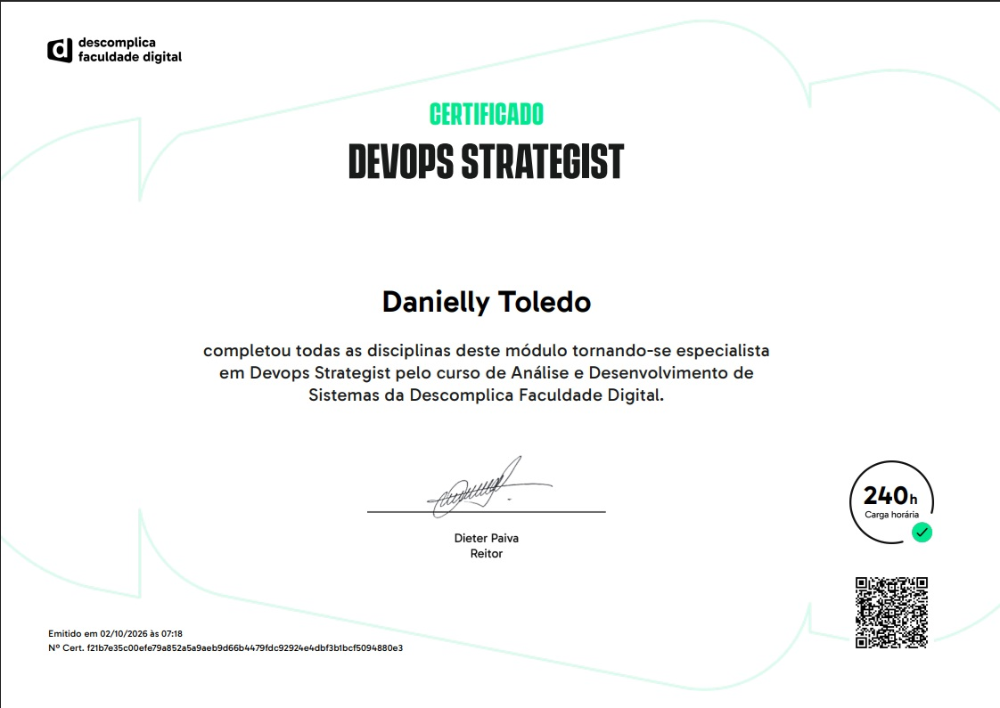

# Módulo 4A — DevOps e Computação em Nuvem

Este módulo abrange três grandes áreas que se complementam: os fundamentos e práticas de **DevOps**, a **orquestração de contentores com Kubernetes**, e a aplicação prática de **computação em nuvem com AWS**. Em conjunto, formam a base técnica para entender como software moderno é desenvolvido, entregue e operado em ambientes de nuvem.

---

## 📁 DevOps I

Introdução aos conceitos e ferramentas que sustentam a cultura e a prática de DevOps — desde a infraestrutura de TI até à entrega contínua de software.

### 00 — Eficiência e Escalabilidade em Infraestrutura de TI
Evolução histórica da infraestrutura: do modelo **On-Premises** (um servidor por aplicação, alto desperdício) ao surgimento do **hypervisor** (múltiplas VMs num único servidor físico), passando pelos **contentores** (isolamento leve, do tamanho da aplicação). Comparação directa entre escalabilidade On-Premises vs. contentores: velocidade, granularidade, custo e automação.

### 01 — Eficiência Operacional na Entrega de Software
O ciclo **build → deploy → run** e as preocupações de cada etapa. Como era a colaboração em código antes das ferramentas modernas (cópias manuais, merges dolorosos) e o que motivou a criação do **SCM (Source Control Management)**. Conceitos centrais do **Git** (repositório, commit, branch, merge, pull request). O **GitLab** como plataforma que une SCM, CI e CD num único produto. Benefícios da automação com **pipelines**: velocidade, consistência, feedback rápido e redução do risco de deploy.

### 02 — Front-end, Back-end e Persistência de Dados
Segregação de responsabilidades de um software completo: **front-end** (interface com o usuário), **back-end** (lógica de negócio e regras), e **persistência de dados** (armazenamento duradouro). Como as três camadas comunicam através de **APIs REST**, com exemplos práticos dos métodos **GET** (leitura) e **POST** (criação de dados), incluindo diagramas do fluxo completo entre as camadas.

### 03 — Docker: Introdução
O que é o Docker e o problema que resolve ("na minha máquina funciona"). O que é o **Docker Hub**. Do que é feita uma **imagem Docker** (camadas, sistema base, dependências, código). Como instalar o Ubuntu no Windows via **WSL** para usar Docker. Como instalar e correr contentores via CMD. Criação de contentores com `docker run` e o uso de **`-p`** para mapear portas — a diferença entre expor e não expor uma porta. Uso de **tags de versão** nas imagens.

### 04 — Docker: Dockerfile, Imagens e Repositórios
O que é um **Dockerfile** e por que usá-lo. O **sistema de camadas** das imagens Docker — cada instrução `RUN` cria uma camada, e a boa prática de combinar comandos num único `RUN` para manter a imagem leve. Análise linha a linha de um Dockerfile com Nginx. Construir uma imagem com `docker build -t`. **Tageamento** de imagens para organizar versões. Diferença entre **repositório local e remoto** — e por que o nome de uma imagem destinada ao Docker Hub precisa de incluir o prefixo do utilizador.

### 05 — Docker: Volumes, Arquivos e Pastas
Como retomar um ambiente Docker após desligar o computador (`docker ps -a`, `docker start`). O que são **volumes** e por que são essenciais — contentores são efémeros, volumes persistem os dados. Tipos de volume (bind mounts, named volumes). Exemplo prático de "Olá, Mundo" com Nginx usando um volume ligado à pasta do projeto. Como conectar um **banco de dados MySQL** num contentor, criar a ligação no MySQL Workbench, e usar um volume para que os dados do MySQL sobrevivam à remoção e recriação do contentor.

---

## 📁 DevOps II

Aprofundamento em orquestração de contentores com Kubernetes, aplicado nos três principais fornecedores de nuvem: Google Cloud, Microsoft Azure, e AWS.

### 00 — Introdução ao Kubernetes
O que é o Kubernetes (K8s) e o problema que resolve: orquestrar centenas de contentores em múltiplos servidores. Conceitos centrais: **Cluster, Node, Pod, Deployment, Service, Control Plane**. Como o Kubernetes se relaciona com o Docker. O princípio de **estado desejado** (*desired state*). Configuração de um cluster no **Google Kubernetes Engine (GKE)**. Implementação do **Hello-Server** com `kubectl create deployment`. Criação de um **Service** para expor a aplicação. Limpeza e remoção do cluster.

### 01 — História e Conceitos Básicos do Kubernetes
Origens do Kubernetes nos sistemas internos da Google (**Borg** e **Omega**) e o seu lançamento open-source em 2014. Doação à **CNCF** em 2015. Marcos históricos até à actualidade. Os princípios fundamentais: estado desejado, abordagem declarativa, **self-healing**, escalabilidade automática, abstração de infraestrutura. Arquitectura detalhada: **Control Plane** (API Server, etcd, Scheduler, Controller Manager) e **Nodes** (kubelet, container runtime, kube-proxy). Principais componentes: **Pods, Deployments, Services, Volumes, ConfigMaps**. Comparação com Docker Swarm, Apache Mesos, Red Hat OpenShift e Amazon ECS.

### 02 — Introdução ao Docker usando Google Cloud
Conceitos básicos do Docker no contexto do **Google Cloud**. Construção de imagens com **Cloud Build** (remoto, sem depender do motor Docker local). Execução de contentores no Cloud Shell e no **Cloud Run**. Práticas de **depuração** com Docker: `docker logs`, `docker exec -it`, `docker inspect`, `docker history`. Verificação e teste de imagens: teste funcional com `curl`, verificação de tamanho, **análise de vulnerabilidades** com o Artifact Registry, e Container Structure Test.

### 03 — Criação e Gerenciamento de Buckets (Google Cloud e Azure)
**Google Cloud**: criar um bucket no Cloud Storage, torná-lo público via IAM, e testar permissões com funções Python (`google-cloud-storage`, `google-cloud-resource-manager`). Atribuição de papéis IAM a utilizadores com exemplos práticos (viewer, compute admin, service account, IAM admin). **Microsoft Azure**: o **Azure Resource Manager (ARM)** como camada central de gestão de todos os recursos. Habilitação do **gerenciamento de ciclo de vida** (Hot → Cool → Archive). Activação do **controlo de versão** de blobs. Criação de recursos no Azure após criar um contêiner de backup com Recovery Services Vaults.

### 04 — Escalonamento de Clusters Kubernetes
Configuração completa do ambiente no GKE (APIs, região, cluster Autopilot vs. Standard). Construção automatizada de contentores com **Cloud Build** e `cloudbuild.yaml`. Implementação de contentores no GKE com `kubectl apply` (YAML declarativo). **Escalonamento manual** com `kubectl scale` e **automático** com o **Horizontal Pod Autoscaler (HPA)** — comparação com o EC2 Auto Scaling. Actualização de aplicações **sem tempo de inatividade** com **Rolling Updates**, incluindo comandos de acompanhamento e rollback (`kubectl rollout undo`).

### 05 — Cluster Kubernetes e Nginx no Microsoft Azure
Criação de cluster no **AKS (Azure Kubernetes Service)**. Comparação entre **Nginx e Apache**: arquitectura orientada a eventos vs. baseada em processos, uso de memória, casos de uso. Configuração de **Pod com dois contentores** (monolith + nginx como sidecar). Criação de **Service** associado. Exposição via **NodePort** — diferença face ao LoadBalancer. **Rótulos (labels)** nos Pods: o que são, para que servem, como adicionar e filtrar. Divisão do monólito em três **Deployments independentes** (auth, hello, frontend) — transição de arquitectura monolítica para microsserviços.

---

## 📁 Prática Integradora — Computação em Nuvem

Módulo prático de aplicação de computação em nuvem com AWS, cobrindo desde os fundamentos até segurança, governança e análise de custos.

### 00 — Computação em Nuvem
O que é computação em nuvem, como surgiu (do time-sharing dos anos 50 ao lançamento da AWS em 2006), as 5 características essenciais do NIST, os modelos de serviço (IaaS, PaaS, SaaS), os modelos de implementação (pública, privada, híbrida, multi-cloud) e as vantagens e desvantagens do modelo.

### 01 — AWS
O que é a AWS, como funciona (Regiões, AZs, formas de acesso), os principais serviços por categoria (computação, armazenamento, bases de dados, redes, segurança, monitorização), vantagens, o **Free Tier**, e os tipos de perfis/contas: **conta root**, utilizadores IAM, grupos, roles e políticas — com exemplos de JSON e hierarquia de acesso. Boas práticas de segurança.

### 02 — AWS CAF: Framework de Adoção da Nuvem
O **AWS CAF** como guia estratégico para adoptar a nuvem. As **6 perspectivas**: três empresariais (Business, People, Governance) e três técnicas (Platform, Security, Operations). O modelo de preços da AWS: pay-as-you-go, economias de escala, volume discounts. Modelos de compra: On-Demand, Reserved Instances, Savings Plans, Spot. Ferramentas de controlo de custo: Pricing Calculator, Cost Explorer, Billing Alarms.

### 03 — AWS Well-Architected Framework
O framework como guia técnico de qualidade arquitectural. Os **6 pilares**: Excelência Operacional, Segurança, Fiabilidade, Eficiência de Performance, Optimização de Custos e Sustentabilidade. Como influencia projectos de migração, as melhores práticas de rede, e princípios de design geral. O **AWS Well-Architected Tool** para autoavaliação.

### 04 — EC2, Escalabilidade e Tráfego
Visão geral dos serviços de computação (hardware e software como serviço). **Tipos de instâncias EC2**: famílias T, M, C, R, I, G/P e suas características. **Escalabilidade**: vertical vs. horizontal, **EC2 Auto Scaling** (capacidade mínima, desejada, máxima). **Elastic Load Balancing**: tipos (ALB, NLB, GWLB), health checks, e o fluxo completo Auto Scaling + Load Balancer. Guia prático de criação de VM Ubuntu no VirtualBox.

### 05 — Computação em Nuvem sem Servidor
**Amazon SQS** (filas Standard e FIFO) e **Amazon SNS** (pub/sub) para comunicação assíncrona. Conceito de **serverless**: o que significa "abstrair" o servidor. **AWS Lambda**: como funciona, gatilhos comuns, limites técnicos, cold start, e quando não usar. **Contentores**: comparação VM vs. contentor, Docker, ECS, EKS, Fargate. **AWS Elastic Beanstalk**: como orquestra EC2 + Load Balancer + Auto Scaling automaticamente.

### 06 — Prática: Conta Root, Lambda e SQS *(aula avaliada)*
Passo a passo de criação de conta root na AWS. Criação da função Lambda **`sqs-queue-process`** (blueprint "Process messages in an SQS queue"). Criação da fila **`fila-para-teste-sqs`** no Amazon SQS. Criação e execução do teste **`sqs-queue-process-test`** — com prints da prática. Explicação do fluxo completo: mensagem na fila → Lambda acorda → processa → sem servidor sempre ligado.

### 07 — Infraestrutura Global da AWS
Como a AWS nasceu da necessidade interna do e-commerce da Amazon. A estrutura em três níveis: **Regiões** (isolamento geográfico), **Zonas de Disponibilidade** (data centers independentes dentro de uma região) e **Pontos de Presença / Edge Locations** (CDN com CloudFront, Global Accelerator). Como provisionar recursos (Console, CLI, IaC/CloudFormation) e os critérios de escolha de região. **Custo do S3 por região** e as classes de armazenamento (Standard → Glacier Deep Archive).

### 08 — Conectividade com a AWS
Fundamentos de redes: componentes (router, switch, firewall, DNS, load balancer), IPv4 vs. IPv6, sub-redes e notação CIDR, protocolos TCP/UDP/HTTP/SSH, e tabela de portas comuns. **Redes públicas vs. privadas** e o papel da **VPC**. Como a internet funciona como "rede de redes", a rede privada global da AWS, e o conceito de "última milha". **AWS Direct Connect**: ligação física dedicada — o que resolve, como funciona, velocidades, vantagens e comparação com VPN.

### 09 — Armazenamento de Dados
**Amazon EBS**: tipos de volume (gp3, io2, st1, sc1), snapshots, encriptação, e a limitação de acesso por uma instância. **Amazon S3**: objetos, buckets, chaves, durabilidade de 11 noves, casos de uso, versionamento, lifecycle e CRR. **Amazon EFS**: acesso simultâneo por múltiplas instâncias em múltiplas AZs, elasticidade automática, classes (Standard, IA, One Zone). **Comparativo blocos vs. objetos vs. ficheiros**: tabela detalhada e guia de decisão.

### 10 — Bancos de Dados em Nuvem
Modelos de banco na nuvem e vantagens dos serviços geridos. **Amazon RDS**: motores suportados, o que é gerido automaticamente, Multi-AZ e Read Replicas. Gerenciamento: Parameter Groups, Subnet Groups, Security Groups, DMS. **Amazon DynamoDB**: NoSQL, Partition Key, Sort Key, serverless, Streams, Global Tables, TTL. **Amazon Redshift**: OLAP vs. OLTP, armazenamento colunar, integração com S3. **Amazon ElastiCache**: Redis vs. Memcached, casos de uso. **Prática**: criação do banco **`database-descomplica`** no RDS com prints do endpoint.

### 11 — Plataformas como Serviço (PaaS) e Lightsail
O espectro de controlo vs. abstração (EC2 → RDS → Beanstalk → Lambda/Lightsail). O que é **PaaS** e as suas vantagens para developers. **AWS Lightsail**: o que agrega (instâncias, bases de dados, contentores, armazenamento, CDN, IPs), blueprints disponíveis (WordPress, LAMP, MEAN, Node.js, Django), planos com preço fixo mensal, IPs estáticos, e quando o Lightsail deixa de ser suficiente.

### 12 — Monitoramento dos Servidores Virtualizados
As três dimensões do monitoramento: infraestrutura, segurança/auditoria, e custos. **AWS CloudTrail**: o que regista (quem, o quê, onde, quando, de onde), configuração de trails, tipos de eventos, e a integração CloudTrail → CloudWatch → SNS para alertas em tempo real. **Amazon CloudWatch**: métricas automáticas por serviço, CloudWatch Agent para memória e disco, alarmes (estados OK/ALARM/INSUFFICIENT_DATA), CloudWatch Logs, Dashboards, e X-Ray para traces. **AWS Trusted Advisor**: as 5 categorias (custo, performance, segurança, tolerância a falhas, limites) e os níveis de acesso por plano de suporte.

### 13 — Segurança e Ferramentas na Nuvem
**Modelo de Responsabilidade Compartilhada**: AWS cuida da infraestrutura física; o utilizador cuida de dados, identidades, configurações e aplicações — com tabela por modelo de serviço. **MFA**: os três factores de autenticação, tipos suportados pela AWS (TOTP, FIDO2, SMS) e como forçar MFA via política IAM. **AWS IAM**: utilizadores, grupos, roles, políticas (estrutura JSON com Effect/Action/Resource/Condition), tipos de políticas, regras de avaliação, e IAM Access Analyzer. **AWS WAF**: funcionamento ao nível da camada 7, tipos de ataque protegidos, Web ACLs e Managed Rules, e comparação com AWS Shield. **AWS KMS**: tipos de chaves, integração com S3/EBS/RDS/CloudTrail, key policies, rotação automática.

### 14 — Segurança e Privacidade em Ambientes em Nuvem
Os grandes desafios de segurança na nuvem: perímetro dissolto, misconfigurations, multitenancy, conformidade. O modelo **Zero Trust**. Ameaças específicas de **SaaS**: controlo mínimo, soberania dos dados, Shadow IT, phishing. Segurança em **IaaS**: responsabilidade operacional total (patches, portas abertas, credenciais expostas). Segurança em **PaaS**: vulnerabilidades da aplicação, supply chain attacks, permissões excessivas em Lambda. **Prática**: criação de bucket S3 com versionamento — tutorial com prints. Relatório comparativo de três serviços de nuvem (Azure, Google Cloud, Backblaze B2): [`atividades_praticas/01_custo_seguranca_nuvens.pdf`](./atividades_praticas/01_custo_seguranca_nuvens.pdf).

### 15 — Governança em TI e Indústria 4.0
**Governança em TI**: o que é, por que é crítica, frameworks (COBIT, ITIL, ISO 38500, ISO 27001) e os 4 pilares (alinhamento estratégico, entrega de valor, gestão de risco, medição de desempenho). **Indústria 4.0**: as 4 revoluções industriais, tecnologias habilitadoras (IoT, Big Data, IA, Cloud, Edge Computing, Robótica, Digital Twins). **Gestão de projectos em ambiente 4.0**: metodologias ágeis, integração de sistemas legados, segurança desde o design, gestão da mudança organizacional. **Competências individuais**: literacia de dados, pensamento sistémico, aprendizagem contínua, perfil T-Shaped.

### 16 — Análise de Custos na AWS
**AWS Organizations**: gestão centralizada de múltiplas contas, faturação consolidada e descontos por volume, Service Control Policies (SCPs), AWS Control Tower. **BYOL (Bring Your Own License)**: License Included vs. BYOL, regras por fornecedor (Microsoft, Oracle, Red Hat), AWS Dedicated Hosts. **AWS Budgets**: tipos de budget (custo, uso, Savings Plans, Reservations), alertas baseados em custo real e em previsão, Budget Actions automáticas. **AWS Cost Explorer**: análise histórica, detecção de anomalias com ML, previsões, recomendações de Savings Plans. **AWS Pricing Calculator**: estimar antes de migrar, o que inclui e o que não inclui, e a linha temporal das três ferramentas de custo.

---

## 🏆 Certificado

